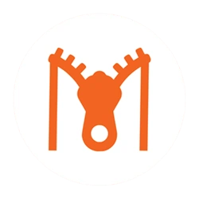

# Minomax - Elevate Your Web Performance with Advanced Optimization

Minomax is a versatile and powerful optimization tool designed to elevate the performance of your web projects. Whether you're a developer focused on improving load times or a business committed to delivering a seamless user experience, Minomax provides the comprehensive solution you need. By compressing images, videos, and web documents, and generating optimized content tailored for various devices, Minomax ensures your website runs faster, saves bandwidth, and delivers an exceptional experience across all platforms.

### Supported Platforms

---

  

  

  

---

  

  

  

---

  

  

---

  

---

## Table of Contents 📝

- [Features and Benefits](#features-and-benefits-)
- [Use Cases](#use-cases-)
- [Friendly request to users](#-friendly-request-to-users)

- [Installation - Step-by-Step Guide](#installation---step-by-step-guide-)
- [Usage](#usage)
- [In-Action](#in-action-)

- [License](#license-%EF%B8%8F)
- [Contributing to Our Project](#contributing-to-our-project-)
- [Website](#website-)

- [Contact Information](#contact-information)
- [Credits](#credits-)

## Features and Benefits ✨

* **Image Compression**: Automatically reduce image file sizes without sacrificing quality.
* **Video Compression**: Achieve significant video compression, maintaining quality while reducing file size.
* **Image Set Generation**: Create multiple image sets for different devices, enhancing visual performance across all screens.
* **Web Document Compression**: Minify and compress JavaScript, HTML, and CSS files for faster load times.
* **Automatic Tag Conversion**: Convert image tags into modern picture tags with media queries, catering to different devices with image sets.
* **Video Thumbnails**: Generate video thumbnails and include them automatically in the HTML, similar to the handling of picture tags from image tags.
* **Flexible Operation**: Utilize Minomax through an API or a Command Line Interface (CLI), offering flexibility to suit your workflow.

## Use Cases ✅
* **Optimizing Images**: Compress large image files to speed up your website's load time.
* **Video Compression**: Reduce the size of video files to improve performance without losing quality.
* **Responsive Design**: Generate optimized image sets for various devices, ensuring a seamless experience across all screen sizes.
* **Web Performance**: Minify and compress web documents to enhance your site's speed and reduce bandwidth usage.
* **Dynamic Content Delivery**: Automatically convert and optimize image tags for responsive content delivery.
* **Continuous Integration (CI) Integration**: Incorporate Minomax into your CI pipelines, like GitHub Actions or GitLab CI, for automated optimization during deployment.

---

### 🙏🏻 Friendly Request to Users

Every star on this repository is a sign of encouragement, a vote of confidence, and a reminder that our work is making a difference. If this project has brought value to you, even in the smallest way, **please consider showing your support by giving it a star.** ⭐

_"Star" button located at the top-right of the page, near the repository name._

Your star isn’t just a digital icon—it’s a beacon that tells us we're on the right path, that our efforts are appreciated, and that this work matters. It fuels our passion and drives us to keep improving, building, and sharing.

If you believe in what we’re doing, **please share this project with others who might find it helpful.** Together, we can create something truly meaningful.

Thank you for being part of this journey. Your support means the world to us. 🌍💖

---

## Installation - Step-by-Step Guide 🪜

Follow Below link:

[Getting Started with Minomax](https://minomax.cresteem.com/minomax-getting-started)

## Usage

Everything from top to bottom of Minomax available here - https://minomax.cresteem.com/

## In-Action 🤺

Below reports and compression ratio measured with [Minomax-Demo](https://github.com/cresteem/Minomax-Demo) results, check out - https://github.com/cresteem/Minomax-Demo

**Results Speak 📊**

### Image Compression
* **Original Size**: 43.9 MB
* **Compressed Size**: 1.44 MB
* **Compression Ratio**: 96.72%

### Video Compression
* **Original Size**: 15.2 MB
* **Compressed Size**: 1.04 MB
* **Compression Ratio**: 93.16%

### Web Document Compression
* **Original Size**: 175 KB
* **Compressed Size**: 131 KB
* **Compression Ratio**: 25.14%

## License ©️

This project is licensed under the [Apache License 2.0](LICENSE).

## Contributing to Our Project 🤝

We’re always open to contributions and fixing issues—your help makes this project better for everyone.

If you encounter any errors or issues, please don’t hesitate to [raise an issue](../../issues/new). This ensures we can address problems quickly and improve the project.

For those who want to contribute, we kindly ask you to review our [Contribution Guidelines](CONTRIBUTING) before getting started. This helps ensure that all contributions align with the project's direction and comply with our existing [license](LICENSE).

We deeply appreciate everyone who contributes or raises issues—your efforts are crucial to building a stronger community. Together, we can create something truly impactful.

Thank you for being part of this journey!

## Website 🌐

<a id="url" href="https://minomax.cresteem.com">minomax.cresteem.com</a>

## Contact Information

For any questions, please reach out via connect@cresteem.com

## Credits 🙏🏻

Minomax is an open-source project developed and maintained by [DARSAN](https://darsan.in/) at [CRESTEEM](https://cresteem.com/), a leading web development company.

---

  

---

  

  

  

  

  

---

#### Topics

<ul id="keywords">
<li>web optimization</li>
<li>image compression</li>
<li>video compression</li>
<li>web performance</li>
<li>responsive design</li>
<li>SEO</li>
<li>CI/CD</li>
<li>npm package</li>
<li>automated optimization</li>
<li>command line tool</li>
<li>web development</li>
<li>file compression</li>
<li>dynamic content delivery</li>
<li>fast load times</li>
<li>api integration</li>
</ul>
